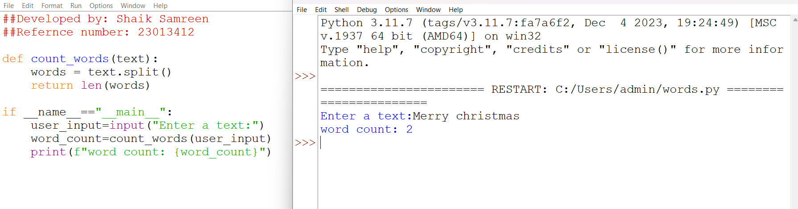

# Word-count
## AIM:
To write a python program for getting the word count from a text.
## EQUIPEMENT'S REQUIRED: 
PC
Anaconda - Python 3.7
## ALGORITHM: 
### Step 1:
Create a function name count_words() .
### Step 2: 
 Split the user text using split() method.
### Step 3: 
Print the length of the word using len() method.
### Step 4:  
Here the main function begins. Take the input function from the user and store it in user_input variable.
### Step 5: 
To count the words execute the above function by function calling.Use print() to print the output. 
### Step 6: 
Execute the program.
## PROGRAM: 
``` 

##Developed by: Shaik Samreen
##Refernce number: 23013412

def count_words(text):
    words = text.split()
    return len(words)

if __name__=="__main__":
    user_input=input("Enter a text:")
    word_count=count_words(user_input)
    print(f"word count: {word_count}")


```
### OUTPUT:



## RESULT:
Thus the program is written to find the word count from a text.
